# 🚀 SmartCreator - IA Video Strategist

O **SmartCreator** é um ecossistema de gerenciamento estratégico para criadores de conteúdo do YouTube. O sistema integra dados reais da **YouTube Data API v3** com uma lógica de **Inteligência Artificial** para automatizar o planejamento de postagens, analisar o sentimento do público e organizar o fluxo de produção de roteiros.

---

## ✨ Funcionalidades Principais

* **📊 Dashboard em Tempo Real:** Visualização dinâmica de inscritos, visualizações e evolução do canal via Chart.js.
* **🤖 IA Strategy Engine:** A IA decide automaticamente os melhores horários e dias de pico com base no nicho do canal e na frequência de postagem desejada.
* **🧠 Trend Predictor:** Previsão de tendências e temas em alta para auxiliar na criação de conteúdo.
* **📝 Fluxo de Roteiros (Kanban):** Gerenciamento completo do status de produção (Pendente, Gravando, Editando, Postado).
* **💬 Análise de Sentimento:** Processamento automático de comentários para medir a recepção do público.
* **🔐 Autenticação Google OAuth2:** Conexão segura e direta com a conta do YouTube do usuário.

---

## 🛠️ Tecnologias Utilizadas

* **Back-end:** [Python](https://www.python.org/) + [Django Framework](https://www.djangoproject.com/)
* **Banco de Dados:** [MySQL](https://www.mysql.com/)
* **APIs:** YouTube Data API v3 & YouTube Analytics API
* **Front-end:** HTML5, CSS3 (Modern UI/UX), JavaScript (jQuery & Chart.js)
* **Segurança:** Django AllAuth (OAuth2)

---

## 🚀 Como Rodar o Projeto

1. **Clone o repositório:**
   ```bash
   git clone [https://github.com/seu-usuario/smartcreator.git](https://github.com/seu-usuario/smartcreator.git)

2. **Crie e ative um ambiente virtual:**

python -m venv venv
source venv/bin/activate  # No Windows: venv\Scripts\activate

3. **Instale as partes:**

pip install -r requirements.txt

4. **Configure as credenciais do Google:**

Crie um arquivo .envou configure suas settings.pychaves CLIENT_ID
e CLIENT_SECRETobtenha no Console do Google Cloud.

5. **Fiz as migrações e iniciei o servidor:**

python manage.py migrate
python manage.py runserver


**📸 Capturas de tela do Sistema**

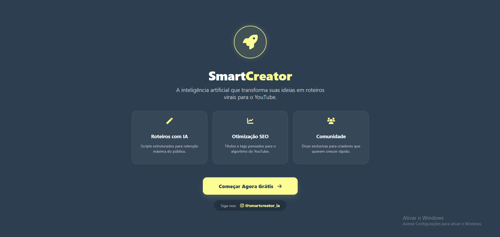

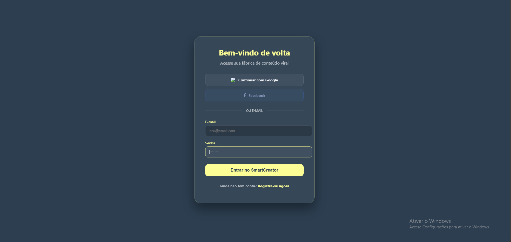

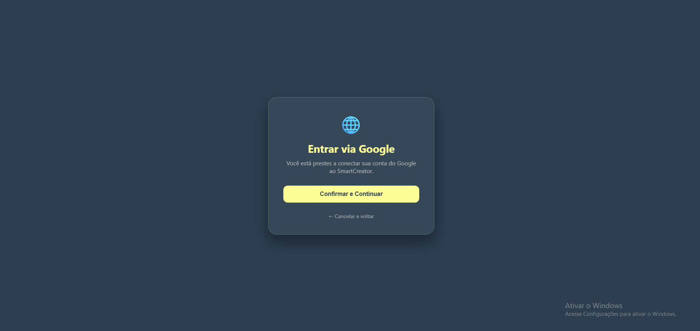

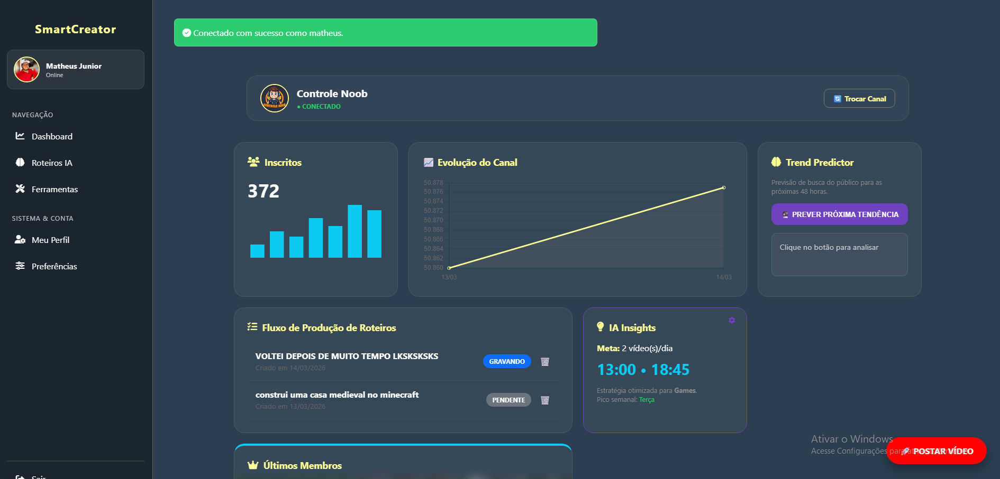

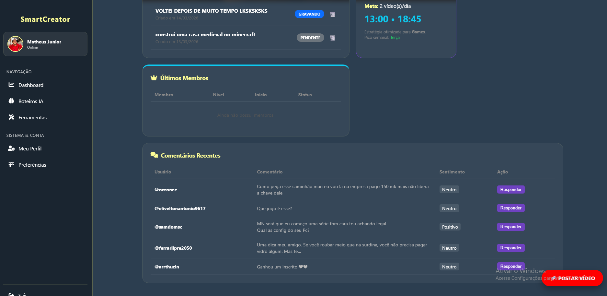

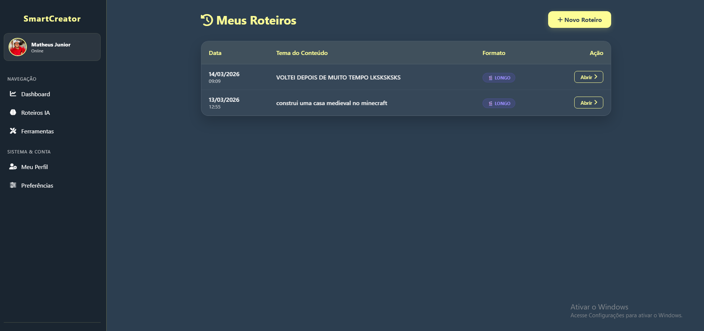

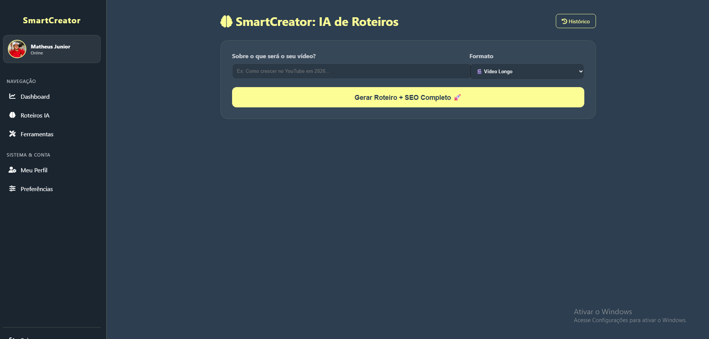

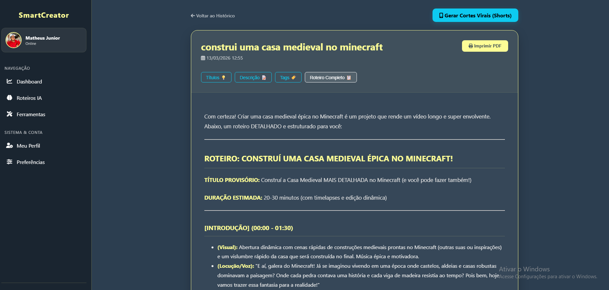

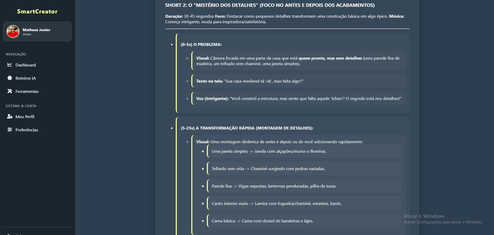

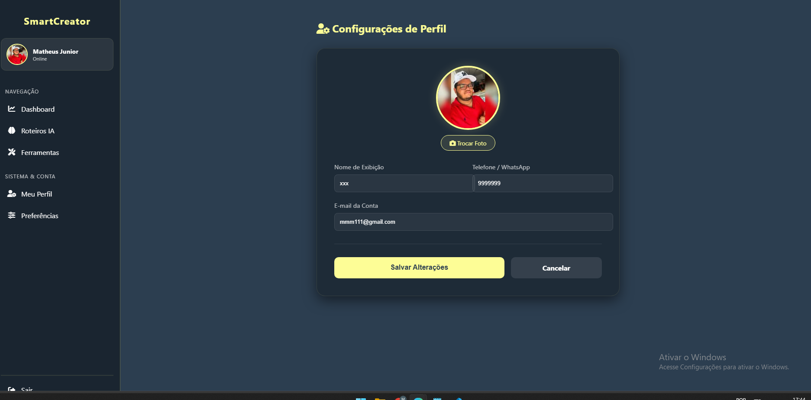

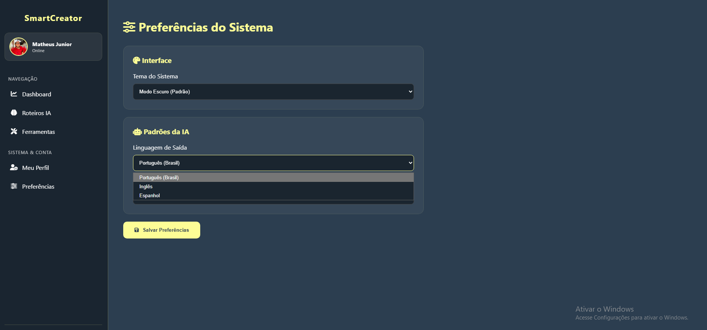

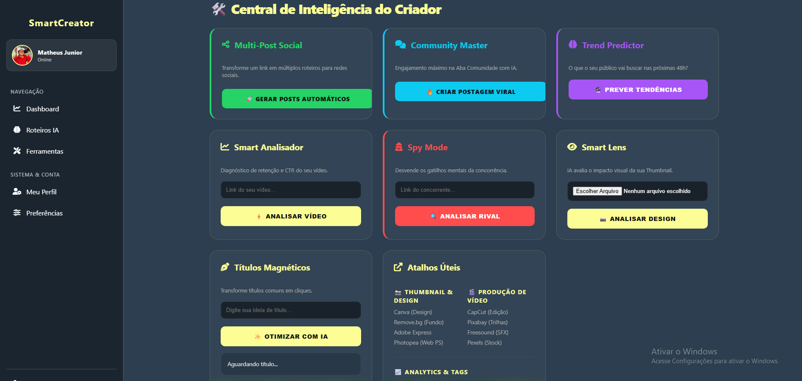


**👨‍💻 Desenvolvedor**

Matheus Júnior 

Este projeto foi desenvolvido com foco em automação e escalabilidade para YouTubers.
